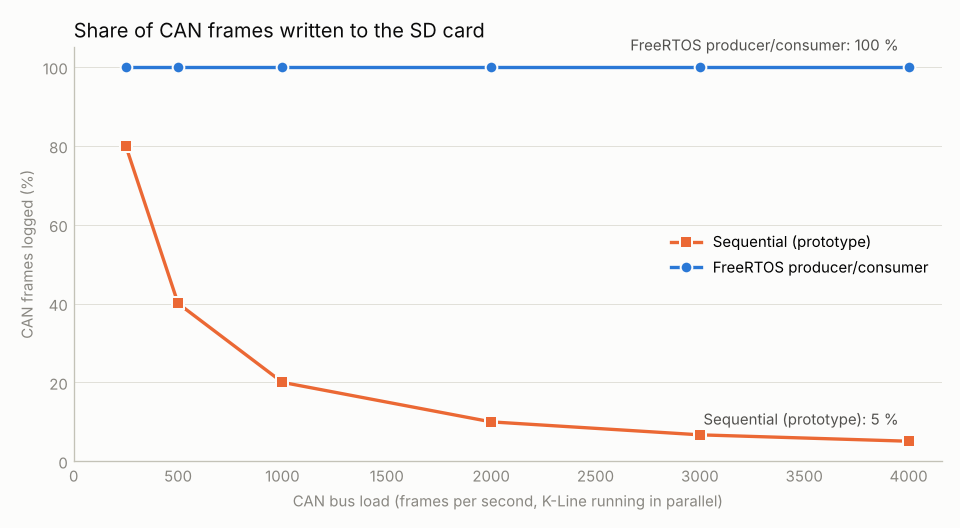
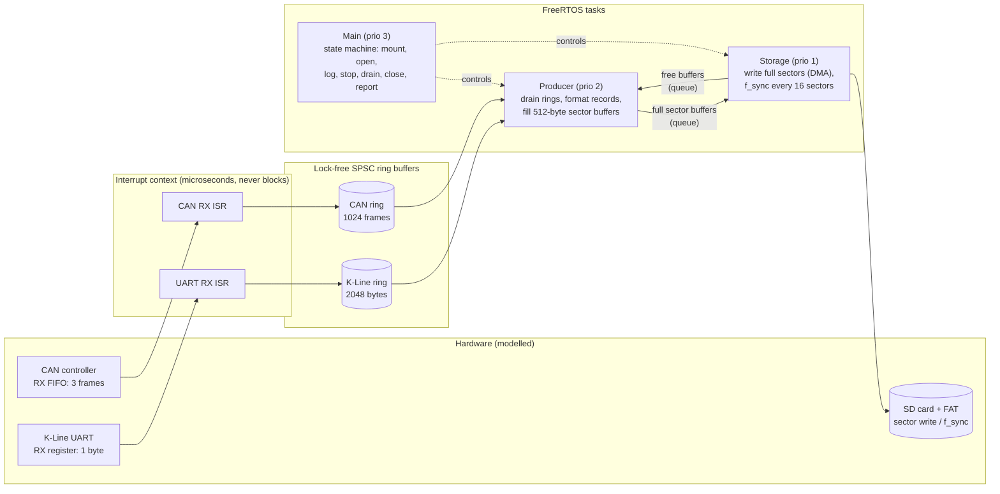

# RTOS Data Logger for CAN and K-Line

**Why a sequential embedded logger loses most of its data, and how a FreeRTOS
producer/consumer design fixes it.**

A vehicle data logger records CAN and K-Line (ISO 9141 / KWP2000) traffic to an SD
card. If the interrupt handler writes every message to the card itself, the CPU is
stuck in slow card writes while new frames arrive, the controller's tiny receive
buffers overflow, and data is silently lost. This project shows both designs on
**real FreeRTOS** (running on Linux through the official POSIX port) with an
event-timed model of the bus hardware and the SD card, and measures the difference.



| CAN load | Sequential (prototype design) | FreeRTOS producer/consumer |
|---:|---:|---:|
| 250 frames/s | 80.0 % | **100 %** |
| 1000 frames/s | 20.0 % | **100 %** |
| 3000 frames/s | 6.7 % | **100 %** |
| 4000 frames/s | 5.1 % | **100 %** |

*K-Line (10400 baud) runs in parallel: sequential 21 % of bytes logged, RTOS 100 %.
Every received message is accounted for as logged or lost, and the log files contain
exactly the logged number of records.*

## Architecture



**Sequential design (the prototype)**: the CAN/UART interrupt handler formats the
message and does `f_write` + `f_sync` itself. A small append + sync costs
milliseconds, during which the CPU cannot serve interrupts: the 3-frame CAN FIFO and
the 1-byte UART register overflow. At high load the CPU spends all its time in the
handler and the main loop starves.

**RTOS design**:

1. **ISRs only copy** the frame or byte into a **single-producer/single-consumer
   ring buffer** (no locks; acquire/release ordering on the indices) and return.
2. The **producer task** formats records into **512-byte sector buffers** taken from
   a pool, and hands full buffers to the storage task through a FreeRTOS queue.
   Partial buffers are flushed every 500 ms.
3. The **storage task** writes **whole sectors** (cheap per byte, DMA, the CPU stays
   free) and calls `f_sync` only every 16 sectors, then returns the buffer to the pool.
4. The **main task** runs the **state machine**:
   `INIT → MOUNT → OPEN → LOGGING → STOPPING (drain) → CLOSE → REPORT`.

Card latency is thereby decoupled from interrupt handling: bursts are absorbed by
the ring buffers and the sector-buffer pool, and the card sees few large writes
instead of many tiny synced ones.

## Run it

Needs Linux (or WSL on Windows), CMake, a C compiler and Git; FreeRTOS is fetched automatically.

```bash
cmake -S . -B build && cmake --build build
ctest --test-dir build                      # ring buffer tests (incl. 2-thread stress test)

./build/rtos_logger --mode sequential --can-rate 1000 --duration 3 --out logs_seq
./build/rtos_logger --mode rtos       --can-rate 1000 --duration 3 --out logs_rtos

pip install matplotlib && python tools/benchmark.py   # sweep + chart -> docs/
```

```
=== rtos logger, CAN 1000 frames/s, K-Line 945 bytes/s, 3.0 s ===
CAN     received     2999  logged     2999  (100.0 %)  lost: FIFO overrun 0, buffer full 0
K-Line  received     2834  logged     2834  (100.0 %)  lost: UART overrun 0, buffer full 0
SD      417 writes, 54 syncs, 207620 bytes
```

Output per run: `can.asc` (Vector ASC style), `kline.log`, `stats.json`.

## The model

The tasks, queues and scheduling are real FreeRTOS. The hardware is modelled:

| Part | Model | Default |
|---|---|---|
| CAN controller | frames arrive at a fixed rate; the ISR runs immediately unless another handler is still running; meanwhile up to 3 frames wait (STM32 bxCAN FIFO), the rest overrun | 3-frame FIFO |
| K-Line UART | 10400 baud, ~945 bytes/s, 1-byte receive register | overrun on 2nd byte |
| SD append + sync | small `f_write` + `f_sync` (sector read-modify-write + FAT update), CPU busy-waits | 2.5 ms |
| SD sector write | full 512-byte sector via DMA, CPU free | 1.2 ms |
| SD sync | `f_sync` in the RTOS design | 6 ms every 16 sectors |

Interrupts are event-timed: data only waits in the hardware buffers while the CPU
is inside a handler, as on a single-core MCU with equal-priority interrupts. The
SD timings are typical orders of magnitude for microSD cards, not measurements of
a particular card; change them in `src/main.c` (`g_cfg`) to explore other cards.

## Porting to an STM32

The structure maps directly onto STM32Cube HAL + FreeRTOS (CMSIS-RTOS) + FatFs:

| Here | On the MCU |
|---|---|
| `rtos_can_isr()` | `HAL_CAN_RxFifo0MsgPendingCallback()` → `rb_put()` |
| `rtos_kline_isr()` | `HAL_UART_RxCpltCallback()` (1 byte, re-armed) → `rb_put()` |
| `sd_write_sector_dma()` | `f_write()` on FatFs with the SDIO + DMA driver |
| `sd_sync()` | `f_sync()` |
| `bus.c` | the real CAN/UART peripherals (delete the file) |

On a Cortex-M the ring buffer indices need no atomics beyond aligned 32-bit
loads/stores and a compiler barrier; the GCC `__atomic` builtins used here compile
to exactly that.

## Background

I first solved this problem in a 2017 embedded-software internship, where I moved an
STM32F4 (Cortex-M4) CAN/K-Line data logger from a sequential prototype to a FreeRTOS
architecture: all hardware interrupts were captured, and the share of data written to
the SD card rose **from 6.7 % to 71 %** on the real hardware. This repository is a new,
independent implementation of the same ideas so that they can be run and inspected
without the original hardware; it contains no code from that project. Two lessons
from it are built in here: ring-buffer indices must be wide enough for the buffer
(32-bit free-running counters, power-of-two size), and the card should only see
whole-sector writes with infrequent syncs.

## Project layout

```
src/main.c          logger: both designs, producer/storage/main tasks, state machine, CLI
src/ringbuffer.c    lock-free SPSC ring buffer
src/bus.c           event-timed CAN controller + K-Line UART model
src/sd.c            SD card / FAT timing model (data really written to files)
src/model.h         configuration, record types, statistics
include/FreeRTOSConfig.h
tests/              ring buffer unit + stress tests (ctest)
tools/benchmark.py  load sweep, CSV + chart
docs/               benchmark.csv, benchmark.png
```

## Tech

C11 · FreeRTOS (V11, POSIX port) · lock-free data structures · CAN · K-Line ·
SD/FAT · CMake · Python/matplotlib · GitHub Actions

## Licence

MIT, see [LICENSE](LICENSE). FreeRTOS is MIT-licensed and fetched at build time.
